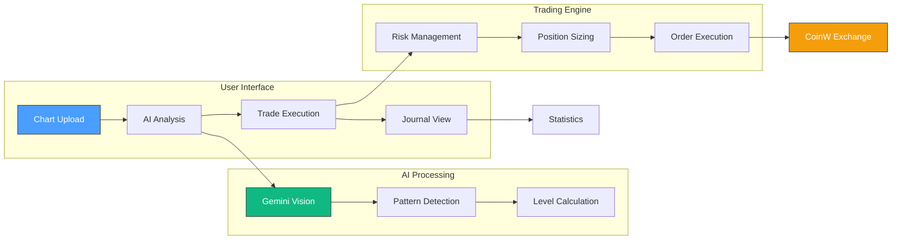
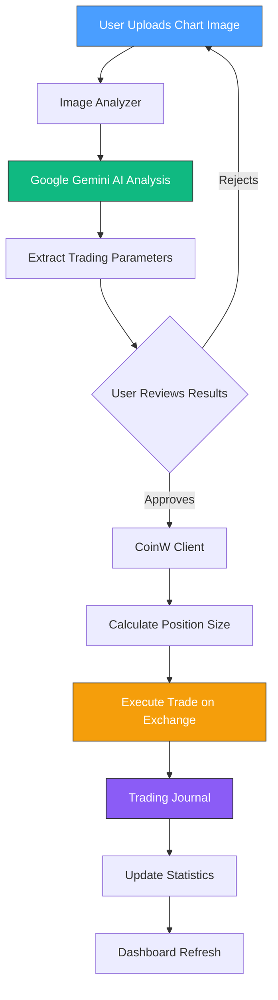
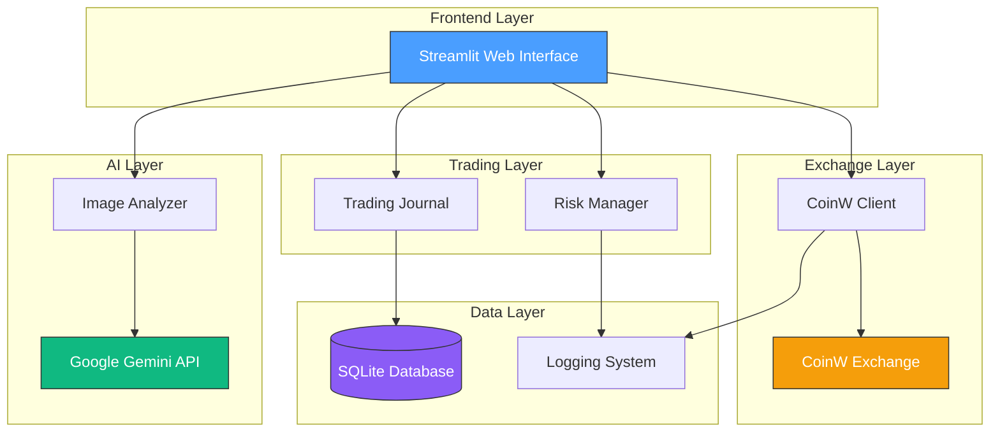
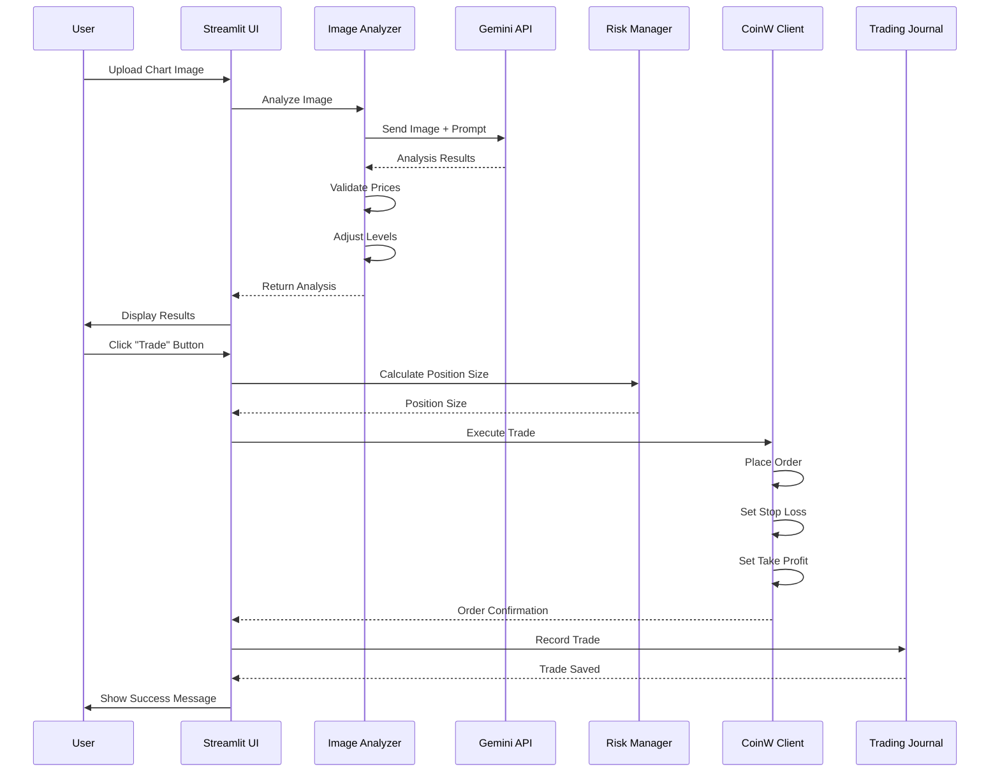

# 🚀 Trading AI Pro - Professional Trading System with AI

<div align="center">


**An advanced trading platform powered by AI for intelligent market analysis and automated trade execution**

[Features](#-features) • [Quick Start](#-quick-start) • [Documentation](#-documentation) • [Architecture](#-architecture)

</div>

---

## 📖 Overview

**Trading AI Pro** is a comprehensive trading system that combines artificial intelligence with professional trading tools. Upload chart screenshots, get AI-powered analysis, and execute trades directly on CoinW exchange - all from a beautiful, modern web interface.

### ✨ Key Highlights

- 🤖 **AI-Powered Chart Analysis** - Upload trading charts and get instant entry, stop-loss, and take-profit levels
- 🔄 **Direct Exchange Integration** - Execute trades directly on CoinW with your own API credentials
- 📊 **Real-Time Account Monitoring** - View balance, open positions, and P&L in real-time
- 📝 **Trading Journal** - Track all your trades with detailed statistics and performance metrics
- 🎨 **Modern UI** - Beautiful, intuitive interface built with Streamlit
- 🔒 **Secure** - Your API credentials are stored only in your browser session

---

## 🎯 Features

### 🔍 AI Chart Analysis

Upload a screenshot of any trading chart and let our AI analyze it:

- **Automatic Detection:**
  - Asset symbol (ETH/USDT, BTC/USDT, etc.)
  - Position type (Long/Short recommendation)
  - Optimal leverage (1x-100x)
  - Trading strategy (Breakout, Reversal, Trend Following, etc.)
  
- **Trading Levels:**
  - Entry price
  - Stop loss (adjusted for leverage)
  - Take profit (minimum 2:1 risk-reward ratio)
  - Current price reading

- **Analysis Details:**
  - Pattern detection
  - Confidence level (0-100%)
  - Risk-reward ratio
  - Detailed reasoning for each recommendation

**Powered by:** Google Gemini 2.5 Flash Lite

### 💱 Direct Exchange Trading

Connect your CoinW account and execute trades directly:

- **Secure API Integration:**
  - Credentials stored only in browser session
  - Never shared with servers or other users
  - Automatic cleanup when browser closes

- **Real-Time Account Info:**
  - Available balance
  - Total balance
  - Open positions with P&L
  - Leverage and margin mode

- **One-Click Trading:**
  - Execute trades with AI-recommended levels
  - Automatic position sizing based on risk
  - Stop loss and take profit orders placed automatically

### 📊 Trading Journal

Comprehensive trade tracking and analytics:

- **Trade Management:**
  - Record all trades with detailed information
  - Filter by symbol, status, or date
  - Export data for external analysis

- **Performance Metrics:**
  - Total trades count
  - Win rate percentage
  - Total P&L
  - Average P&L per trade
  - Best and worst trades

- **Statistics Dashboard:**
  - Real-time updates
  - Visual performance indicators
  - Historical analysis

### 🎨 Modern User Interface

Beautiful, professional design:

- **Dark Theme** - Easy on the eyes for long trading sessions
- **Responsive Layout** - Works on desktop and tablet
- **Intuitive Navigation** - Simple, clean interface
- **Real-Time Updates** - Instant feedback on all actions

---

## 🚀 Quick Start

### Prerequisites

- Python 3.10 or higher
- pip (Python package manager)
- CoinW account (for trading features)
- Google Gemini API key (for AI analysis)

### Installation

1. **Clone the repository:**
   ```bash
   git clone https://github.com/MarxMad/Trading_AI_tool.git
   cd Trading_AI_tool
   ```

2. **Create virtual environment:**
   ```bash
   python -m venv venv
   source venv/bin/activate  # On Windows: venv\Scripts\activate
   ```

3. **Install dependencies:**
   ```bash
   pip install -r requirements.txt
   ```

4. **Configure environment variables:**
   
   Create a `.env` file in the root directory:
   ```env
   # Google Gemini API (Required for AI analysis)
   GEMINI_API_KEY=your_gemini_api_key_here
   
   # CoinW API (Optional - for trading features)
   COINW_API_KEY=your_coinw_api_key_here
   COINW_API_SECRET=your_coinw_api_secret_here
   ```

5. **Run the application:**
   ```bash
   streamlit run app.py
   ```

   Or use the provided script:
   ```bash
   ./run_simple.sh
   ```

6. **Access the application:**
   
   Open your browser and navigate to: `http://localhost:8501`

### First Steps

1. **Configure Gemini API:**
   - Get your API key from [Google AI Studio](https://makersuite.google.com/app/apikey)
   - Add it to your `.env` file or Streamlit Cloud secrets
   - See [CONFIGURACION_GEMINI.md](CONFIGURACION_GEMINI.md) for details

2. **Configure CoinW API (Optional):**
   - Create API key in your CoinW account
   - Enter credentials in the sidebar when using the app
   - See [CONFIGURACION_COINW.md](CONFIGURACION_COINW.md) for detailed instructions

3. **Start Analyzing Charts:**
   - Upload a chart screenshot
   - Select margin mode (Cross or Isolated)
   - Click "Analyze Chart with AI"
   - Review the AI recommendations
   - Execute trade directly on CoinW (if configured)

---

## 📁 Project Structure

```
Trading_AI_tool/
├── app.py                      # Main Streamlit application
├── requirements.txt            # Python dependencies
├── config/
│   └── config.yaml            # Configuration file
├── data/
│   ├── collectors/            # Data collection modules
│   │   └── yfinance_collector.py
│   └── processors/            # Data processing
│       └── technical_indicators.py
├── monitoring/
│   ├── image_analyzer.py      # AI chart analysis (Gemini)
│   └── trading_journal.py     # Trade tracking system
├── exchanges/
│   └── coinw_client.py        # CoinW API integration
├── risk/
│   └── risk_manager.py        # Risk management & position sizing
├── payment/
│   └── stripe_handler.py      # Subscription management
├── database/
│   └── db_handler.py          # Database operations
└── utils/
    ├── config_loader.py       # Configuration loader
    └── logger.py              # Logging utility
```

---

## 🏗️ Architecture

### System Overview



### Core Components

#### 1. **Image Analyzer** (`monitoring/image_analyzer.py`)
- Analyzes trading chart screenshots using Google Gemini Vision
- Automatically detects trading parameters
- Validates and adjusts recommended levels
- Returns structured analysis data

#### 2. **CoinW Client** (`exchanges/coinw_client.py`)
- Secure API integration with CoinW exchange
- Account balance retrieval
- Position management
- Order execution (market, limit, stop-loss, take-profit)

#### 3. **Trading Journal** (`monitoring/trading_journal.py`)
- Trade recording and storage
- Performance statistics calculation
- Trade filtering and search
- Data export capabilities

#### 4. **Risk Manager** (`risk/risk_manager.py`)
- Position sizing based on risk percentage
- Stop loss and take profit calculations
- Capital management
- Risk metrics tracking

### Data Flow



### System Architecture



### Chart Analysis Process



---

## 🔧 Configuration

### Environment Variables

| Variable | Required | Description |
|----------|----------|-------------|
| `GEMINI_API_KEY` | Yes | Google Gemini API key for AI analysis |
| `COINW_API_KEY` | No | CoinW API key for trading |
| `COINW_API_SECRET` | No | CoinW API secret for trading |

### Configuration Files

- **`config/config.yaml`** - Main configuration file
- **`.env`** - Environment variables (not committed to git)

### Streamlit Cloud Deployment

For production deployment on Streamlit Cloud:

1. Push your code to GitHub
2. Connect repository to Streamlit Cloud
3. Add secrets in Streamlit Cloud dashboard:
   ```toml
   GEMINI_API_KEY = "your_api_key_here"
   ```
4. Deploy!

See [Streamlit Cloud Documentation](https://docs.streamlit.io/deploy/streamlit-community-cloud) for details.

---

## 📚 Documentation

### Setup Guides

- **[Gemini Configuration](CONFIGURACION_GEMINI.md)** - How to set up Google Gemini API
- **[CoinW Configuration](CONFIGURACION_COINW.md)** - Complete guide for CoinW API setup
- **[Stripe Configuration](CONFIGURACION_STRIPE.md)** - Subscription payment setup

### User Guides

- **[Quick Start Guide](QUICK_START.md)** - Get started in 5 minutes
- **[Interface Guide](INTERFAZ_GRAFICA.md)** - Detailed UI documentation
- **[Implementation Plan](PLAN_IMPLEMENTACION.md)** - Development roadmap

### API Documentation

- **Image Analyzer API** - See `monitoring/image_analyzer.py` docstrings
- **CoinW Client API** - See `exchanges/coinw_client.py` docstrings
- **Trading Journal API** - See `monitoring/trading_journal.py` docstrings

---

## 🛠️ Development

### Adding New Features

The codebase is modular and easy to extend:

#### Adding a New Exchange

1. Create a new client in `exchanges/`:
   ```python
   class NewExchangeClient:
       def get_account_balance(self):
           # Implementation
       def place_order(self, ...):
           # Implementation
   ```

2. Update `app.py` to support the new exchange:
   ```python
   from exchanges.new_exchange_client import NewExchangeClient
   ```

#### Adding New AI Models

1. Extend `ImageAnalyzer` class:
   ```python
   def _analyze_with_new_model(self, image):
       # Implementation
   ```

2. Add model selection logic in `analyze_chart_image()`

#### Customizing Risk Management

Modify `risk/risk_manager.py`:
- Adjust position sizing algorithms
- Add new risk metrics
- Implement custom stop-loss strategies

### Testing

Run tests (when implemented):
```bash
pytest tests/
```

### Code Style

Follow PEP 8 guidelines. The project uses:
- Type hints where applicable
- Docstrings for all functions/classes
- Logging instead of print statements

---

## 🔒 Security

### API Credentials

- **Never commit API keys to version control**
- Credentials are stored in `.env` (local) or Streamlit secrets (cloud)
- CoinW credentials are stored only in browser session (temporary)
- All API communications use HTTPS

### Best Practices

1. **CoinW API Security:**
   - Enable 2FA on your CoinW account
   - Use IP whitelisting
   - Never enable "Withdraw" permission
   - Only enable permissions you need (Read, Trade)

2. **Application Security:**
   - Keep dependencies updated
   - Review code before deploying
   - Use environment variables for secrets
   - Regular security audits

---

## 📊 Performance Metrics

The system tracks various performance metrics:

- **Win Rate** - Percentage of profitable trades
- **Total P&L** - Cumulative profit/loss
- **Average P&L** - Average profit per trade
- **Risk-Reward Ratio** - Average risk to reward ratio
- **Sharpe Ratio** - Risk-adjusted returns (future)
- **Maximum Drawdown** - Largest peak-to-trough decline (future)

---

## 🚨 Important Disclaimers

### Trading Risks

⚠️ **Trading involves substantial risk of loss. Past performance does not guarantee future results.**

- Never trade with money you cannot afford to lose
- AI recommendations are for informational purposes only
- Always do your own research before trading
- Start with small positions and scale gradually
- Use proper risk management (stop losses, position sizing)

### AI Limitations

- AI analysis is based on chart patterns and technical indicators
- Market conditions can change rapidly
- AI may not account for all market factors
- Always verify AI recommendations before trading
- Confidence levels are estimates, not guarantees

### Exchange Integration

- This tool connects directly to CoinW exchange
- You are responsible for all trades executed
- Review all orders before execution
- Monitor your positions regularly
- Understand exchange fees and margin requirements

---

## 🤝 Contributing

Contributions are welcome! Here's how you can help:

1. **Fork the repository**
2. **Create a feature branch** (`git checkout -b feature/amazing-feature`)
3. **Make your changes**
4. **Commit with clear messages** (`git commit -m 'Add amazing feature'`)
5. **Push to your branch** (`git push origin feature/amazing-feature`)
6. **Open a Pull Request**

### Contribution Guidelines

- Follow existing code style
- Add docstrings to new functions
- Update documentation for new features
- Test your changes thoroughly
- Keep commits focused and atomic

---

## 📝 License

This project is licensed under the MIT License - see the LICENSE file for details.

---

## 🙏 Acknowledgments

- **Google Gemini** - For powerful AI vision capabilities
- **Streamlit** - For the amazing web framework
- **CoinW** - For exchange API access
- **Open Source Community** - For various libraries and tools

---

## 📞 Support

- **Documentation Issues** - Open an issue on GitHub
- **Bug Reports** - Use GitHub Issues with detailed description
- **Feature Requests** - Submit via GitHub Issues
- **Questions** - Check documentation first, then open a discussion

---

## 🗺️ Roadmap

### Upcoming Features

- [ ] Support for multiple exchanges (Binance, Bybit, etc.)
- [ ] Advanced backtesting engine
- [ ] Machine learning model training
- [ ] Real-time market data integration
- [ ] Mobile app support
- [ ] Social trading features
- [ ] Advanced risk analytics
- [ ] Portfolio management tools

### Version History

- **v1.0.0** (Current) - Initial release with AI analysis and CoinW integration
- Future versions will include advanced features and optimizations

---

<div align="center">

**Built with ❤️ for the trading community**

[⭐ Star this repo](https://github.com/MarxMad/Trading_AI_tool) if you find it useful!

</div>
